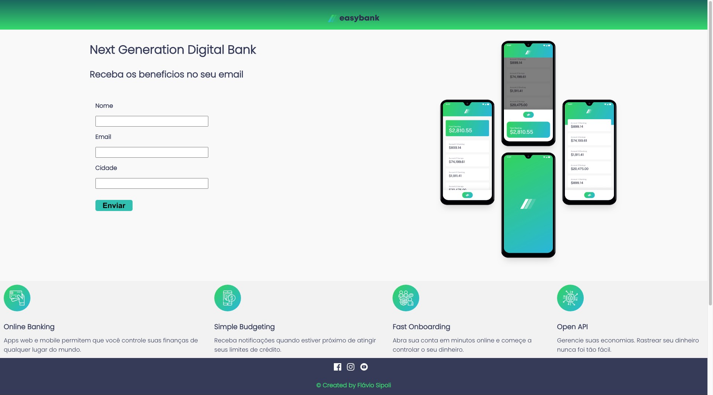

# Projeto Easy Bank

Este projeto foi um desafio proposto pela Gama Academy no treinamento Hiring Coders. 
O objetivo foi criar uma Landing Page para captura de Leads, salvando as informações no Local Storage.

# Tecnologias

-React
-HTML5
-CSS3

# Instalação

Clonar o repositório em sua maquina local, acessar a pasta landing-page-bank e instalar o pacote npm.

$ npm install

# Rodando o projeto localmente

$ npm start

Acesse localhost:3000 em seu browser

# Screenshot

